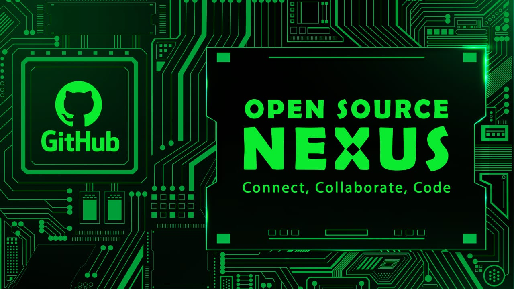

# OpenSourceNexus

Welcome to OpenSourceNexus! This project aims to provide a platform for developers to contribute and collaborate on open-source projects in various programming languages.

## Description

OpenSourceNexus hosts repositories for different programming languages, allowing developers to contribute programs, libraries, and tools written in their language of choice. Whether you're a beginner looking to learn or an experienced developer wanting to share your expertise, there's a place for you here.

## Categories of Contributions

Explore different categories of contributions in OpenSourceNexus:

1. **Easy - Basic Programs:**
   - Start your coding journey by submitting simple programs and code snippets to the "Basic" category. Perfect for beginners, these programs cover fundamental concepts and tasks in programming. Whether it's a "Hello, World!" program or basic data structure implementations, this category welcomes contributions aimed at building a strong foundation in coding.

2. **Medium - Competitive Programming:**
   - Level up your skills with the "Medium" category, where contributors tackle competitive programming challenges. From algorithmic puzzles to data structures exercises, this category is designed to sharpen problem-solving abilities and improve coding efficiency. Join the competition, solve challenges, and elevate your coding prowess.

3. **Hard - Advanced Concepts & Challenges:**
   - we offer the Hard category. Here, contributors can tackle challenging projects that delve deep into the realm of complex algorithms and sophisticated data structures. From intricate graph algorithms to advanced dynamic programming techniques, this category is designed to push your problem-solving skills to the next level. Whether you're passionate about optimizing code efficiency, mastering algorithmic paradigms, or solving real-world challenges with precision and elegance, you'll find ample opportunities to sharpen your skills and expand your knowledge in the Hard category.
## License

This project is licensed under the terms of the [MIT License](LICENSE).

## Contributing

We welcome contributions from developers of all skill levels. Before contributing, please read our [Contribution Guidelines](CONTRIBUTING.md) for instructions on how to get started and our code of conduct.

## Getting Started

To get started with contributing to OpenSourceNexus, follow these steps:

1. Fork the repository.
2. Clone your forked repository to your local machine.
3. Create a new branch for your contribution: `git checkout -b my-contribution`.
4. Make your changes and commit them: `git commit -m "Add new feature"`.
5. Push your changes to your forked repository: `git push origin my-contribution`.
6. Open a pull request from your forked repository to the main repository.

## Support

If you have any questions or need assistance, please don't hesitate to reach out to us or open an issue in the repository.

## Acknowledgments

We would like to thank all the contributors who have helped make OpenSourceNexus possible.

## Contact

For inquiries, please contact shawnarun09@gmail.com.
